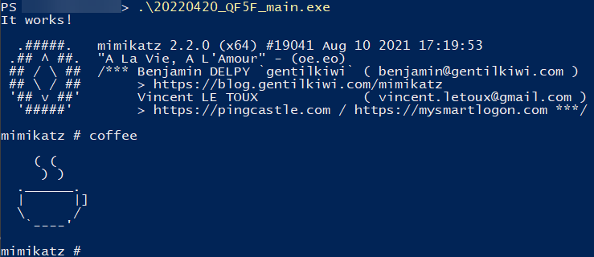

# Uru

Uru is a payload generation tool that enables you to create payload based on a configuration file.

## Prerequisites
To use all the functionnalities offered by Uru, it is recommended to install:
- [garble](https://github.com/burrowers/garble)
  
```
go install mvdan.cc/garble@latest
```

- [bananaphone](https://github.com/C-Sto/BananaPhone)

```
go get github.com/C-Sto/BananaPhone
```

To use the signing option (limelighter), the following packages are needed:
- openssl
- osslsigncode

## Usage

### Generate
The generate command is reponsible for payload generation and uses the following arguments:
```
Take as input a config and a given payload file to generate a payload.

Usage:
  uru generate [flags]

Flags:
      --class string                   .Net Class to call (use with donut)
      --clearheader                    Remove peheader of the payload if set (use with srdi)
  -c, --config string                  Config file that definied the modules to use
      --donut                          Process the given payload as an executable using go-donut
      --functionname string            Methods to call if .Net payload (with donut) or Function name to call after DLL Main (with srdi)
  -h, --help                           help for generate
  -o, --output string                  Output file name
      --parameters string              Parameters to pass to the payload (use with donut/srdi)
  -p, --payload Shellcode/Executable   Shellcode/Executable to use in the generated payload
      --srdi                           Convert dll into a position independant code that uses a rdll loader to execute the dll entrypoint.
```
`-c/--config` a config file, a example is provided, see [example_config.yml](./example_config.yml). The [Config file](#config-file) section will helps you to build your own configuration file.

`-p/--payload` the path to the payload you want to execute/inject.

`--donut` to process the payload as a binary. It will use [go-donut](https://github.com/Binject/go-donut) to obtain a shellcode.

`--parameters` parameters to pass to the payload (works only if `--donut` or `--srdi` is passed as an argument).

`--srdi` convert the payload into a srdi shellcode.

`--clearheader` will remove PE header when using `--srdi`.

`--functionname` will execute a specific function after dllMain, when using `--srdi`.

`--class` .Net Class to call (use with donut).

`-o/--output` to specify a specific output filename and location.

Example:
```
./uru generate -c <pathtoconfig.yml> -p <pathtopayload> --donut
```

### Server mode
The server mode offers the possibility to generate payload through an api call:
```
Start a server with an api enpoint /generate to generate payload. Listen on 0.0.0.0:8081 by default, can be changed with -a/--addr

Usage:
  uru serve [flags]

Flags:
  -a, --addr string   ip:port to listen on the api server (e.g: 127.0.0.1:3000) (default ":8081")
  -h, --help          help for serve
```

`-a/--addr` is the `ip_addr:port` to listen on. By default it listens on `0.0.0.0:8081`.

The api endpoint `/generate` accepts two files in entrypoint:
- `config` the config file
- `payload` the payload to process

It also accepts two parameters:
- `donut` if the payload is an executable, it will use [go-donut](https://github.com/Binject/go-donut) to obtain a shellcode. Must be equal to "true".
- `srdi` convert the payload into a srdi shellcode. Must be equal to "true".
- `parameters` parameters to pass to the binary (need `donut` or `srdi`)
- `functionname` function name / method to call (need `donut` or `srdi`)
- `class` .Net class to pass to go-donut. (need `donut`)
- `clearheader` remove the peHeader (need `srdi`). Must be equal to "true".


Here is an example to use the api call with the curl command:
```
curl -F config=@<path to config> -F payload=@<path to payload> http://127.0.0.1:8081/generate?donut=true -o <your payload name>
```

## Dockerfile

A dockerfile is provided if you want to run the tool in an isolate environment or in your infrastructure.
To build the docker:
```
docker build -t uru .
```

Then, you can use the serve command for example:
```
docker run -p 8081:8081 uru serve --debug
```

## Config file

The config file is the core of your generated payload. It contains modules under a yml structure named "artifacts", and global options.
It is important to note that these modules will be added and executed in the order in which you defined them. For example, you defined a config.yml like this:

```yml
payload:
  artifacts:
    - name: sleep
    type: evasion
    args:
      - name: delay
        value: 10
    - name: xor
      type: encoder
      args:
        - name: Key
          value: "test"
    - name: hex
      type: encoder
[...]
```

The generated payload will perfom the following actions in this order:
1. Sleep while 10 seconds
2. xor the given payload with the key "test"
3. unhex your payload.

More information about these artifacts are detailed in the next sections.

### Global options

Global options correspond to the required/optional options of the generated payload:
| Name        | Description | required (yes/no) |
|-------------|-------------|-------------------|
| type        | Type of payload to compiled. Possible values: exe, pie, cpl, xll or dll. | yes |
| arch        | Architecture of the compiled program: x64 or x86. | yes |
| debug       | Add print and debug functions to the program | no |
| obfuscation | Use garble to obfuscate the code | no |
| append      | Append the provided string at the end of the payload file. Must be hexadecimal ex: 90909090 | no |
| prepend     | Prepend the payload file with the provided string. Must be hexadecimal ex: 90909090 | no |

### Encoders

Encoder are responsible of the payload encoding. Encoding will be process during the payload generation. Then, the opposite actions will be added to generated code.

To encode your payload (and avoid to store it in plaintext), you can use the following "encoders":

| Name          | Description                            |
|---------------|----------------------------------------|
| aes           | Use AES GCM to encrypt given data      |
| hex           | Use hex encoding to encode given data  |
| rc4           | Use rc4 encoding to encode given data  |
| xor           | Use xor algorithm to encode given data |
| zip           | Use zip compression on given data      |
| reverse-order | Reverse the order of the shellcode byte array. |
| uuid          | [experimental/dev] Transform data into UUID string (only works with ninjauuid injector). |

To use an encoder, specify the name, and the type "encoder".

**Note:**

- [SGN](https://github.com/EgeBalci/sgn) is also a valid encoder but the code is commented (see line with "[SGN] - DECOMMENT TO USE SGN") because of cross compilation problem.
- Each encoder (except hex, zip, sgn) has an argument named "Key". You can modify this arguments like this (by default it is a random string):

```yml
[...]
  - name: xor
    type: encoder
    args:
      - name: key
        value: "mykey"
[...]
```

### Evasions

Evasions are the modules that help you to evade AV/EDR:

|      Name      | Description | Argument(s) | Comment |
|:--------------:|-------------|-------------|---------|
| english-words  | Add a random number of english words to the binary. | NumberOfWord: define the number of english words to add to the binary between 1 and 1000. | Note that the words will no be obfuscated when using garble |
| hideconsole    | Prevent windows console to be displayed. | Show: Show the console or not. Default is "false" | |
| isdomainjoined | Check if current computer is joined to a domain. | None | |
| ntsleep        | NtSleep during a fixed amount of time in seconds using NtDelayExecution API call | Delay: the amount of time to sleep, default is 5s | |
| patchamsi      | Path amsi. (credits: method taken from Merlin, @Ne0nd0g) | UseBanana: if set to "true", use bananaphone to perform syscall | |
| patchetw       | Path etw. (credits: method taken from Merlin, @Ne0nd0g) | UseBanana: if set to "true", use bananaphone to perform syscall | |
| patch       | Path a given function. (credits: method taken from Merlin, @Ne0nd0g) |     Module: the module where the function is. Example: "ntdll.dll", Proc: the function to patch. Example: "EtwEventWrite", Data: the data to use to patch the function in hex, UseBanana: if set to "true", use bananaphone to perform syscall | By default it patch etw to its "normal state"|
| selfdelete     | Delete the current binary during runtime | None | |
| sleep          | Sleep during a fixed amount of time in seconds. | Delay: the amount of time to sleep, default is 5s | |
| createmutex    | Create a mutex with a specific name. | MutexName: the name of the mutex, default is "UruMutex" | |
| refreshdll     | Refresh the given dll to remove hook by using the dll on disk. (Inspired by sliver/scarecrow and TimWhitez works). | UseBanana: UseBananaPhone to perform syscall. Default is "false", DllName: Name of the dll to refresh. Default is "C:\\\\Windows\\\\System32\\\\kernel32.dll". | Only work if windows version is "10.0" |


### Injectors

Injectors are the modules that defined a process injection:

| Name                                               | Description |
|----------------------------------------------------|-------------|
| windows/native/local/go-shellcode-syscall          | Executes Shellcode in the current running proccess by making a Syscall on the Shellcode's entry point. |
| windows/native/local/CreateThreadNative            | Use native windows api call CreateThread to inject into the current process. |
| windows/native/local/NtQueueApcThreadEx-Local      | Use native windows api call NtQueueApcThreadEx to inject in the current process |
| windows/bananaphone/local/go-shellcode-syscall     | Executes Shellcode in the current running proccess by making a Syscall on the Shellcode's entry point.  |
| windows/bananaphone/local/NtQueueApcThreadEx-Local | Use native windows api call NtQueueApcThreadExt to inject in the current process. Call is performed using bananaphone from @C-Sto. |
| windows/bananaphone/local/ninjauuid    | [experimental/dev] Module stomping following EnumSystemLocalesA for injection. Injection taken from @boku7 project. uuid encoder must be used as your last encoder. |


**Note:**
- `bananaphone` injections require to install [bananaphone](https://github.com/C-Sto/BananaPhone) from @C-Sto.

### Tampering
Tampering options allow you to alter the paylaod generated. It is inspired from [ScareCrow](https://github.com/optiv/ScareCrow).

You can add metadata to the payload using a json file that contains the information, see [this file](https://github.com/optiv/ScareCrow/blob/main/main.json) for an example.
To add metadata, you must add this option to the config file:
```
file_properties_path: ./<path to the json metadata file>.json
```

You can also signed the binary. It uses [LimeLighter](https://github.com/Tylous/Limelighter).

The options must be defined like this in the config file:
```
limelighter:
  domain: mydomain.com
```

**Note:** Limelighter options "password" and "real" are also supported.

## Define your own artifact

This section will go through an artifact addition.
The first step is to defined the type of the artifact:
- encoder will go to ./pkg/encoder/
- injector will go to ./pkg/injector/
- evasion will go to ./pkg/evasion/

In this example, we will add an evasion module that just print a message.

First, we will add a module under `./pkg/<module type>/<module name>.go`, for our example we will call it `./pkg/evasion/print_testgo`.

The module must implement the model type named `ObjectModel`, see `./pkg/models.go`.

This type requires to implement 3 functions:
-	GetImports: Corresponds to an array of golang import needed by our module
-	RenderInstanciationCode: Will render our instanciation code, how do we instanciate our module
-	RenderFunctionCode: Will render our function(s) code

A completed module will look like this:
```go
package evasion

import (
	"embed"

	"github.com/guervild/uru/pkg/common"
	"github.com/guervild/uru/pkg/models"
)

type PrintTestEvasion struct {
	Name         string
	Description  string
	PrintString string
}

func NewPrintTestEvasion() models.ObjectModel {

	return &PrintTestEvasion{
		Name:         "print-test",
		Description:  `Example of how to implement a module in Uru. 
  Argument(s):
    PrintString: The string to print, default is "Hello World."`,
		PrintString: "Hello World",
	}
}

func (e *PrintTestEvasion) GetImports() []string {
	return []string{
		`"fmt"`,
	}
}

func (e *PrintTestEvasion) RenderInstanciationCode(data embed.FS) (string, error) {
	return common.CommonRendering(data, "templates/evasions/print-test/instanciation.go.tmpl", e)
}

func (e *PrintTestEvasion) RenderFunctionCode(data embed.FS) (string, error) {
	return common.CommonRendering(data, "templates/evasions/print-test/functions.go.tmpl", e)
}
```

Then, will add the new ObjectModel to the corresponding factory:
- Injector factory is located at ./pkg/injectorFactory.go
- Evasion factory is located at ./pkg/evasion.go
- Encoder factory is located at ./pkg/encoder.go

For our example, we will add the new module in ./pkg/evasion.go:
```
[...]
func GetEvasion(evasionType string) (models.ObjectModel, error) {
[...]
	if evasionType == "print-test" {
		return NewPrintTestEvasion(), nil
	}
[...]
```

We can now write the code corresponding to our new modules. The code is embedded inside the binary and is defined inside the `./data/templates/` directory. A module directory is defined like this `./data/templates/<module type>/<module name>`.

We create a file under `./data/templates/evasions/print-test/instanciation.go.tmpl` (corresponding to the path inside the RenderInstanciationCode function). This code will be added inside the `func main` during payload generation (see `./data/templates/core.go.tmpl`). The final code looks like this:
```
printTest("{{ .PrintString }}")
```
`PrintString` corresponds to our argument that we want to render. Here it is just a message we want to print.

Then, we create a file under `./data/templates/evasions/print-test/functions.go.tmpl` (corresponding to the path inside the RenderFunctionCode function). This code will corresponds to the function called by `instanciation.go.tmpl`, and is also added during payload generation (see `./data/templates/core.go.tmpl`). The function code will look like this:
```
func printTest(message string) {
  fmt.Println(message)
}
```

Now we can compile our `main.go`, and call the module in the `config.yml` file:
```
payload:
  artifacts:
    - name: print-test
      type: evasion
      args:
        - name: PrintString
          value: "It works!"
    - name: windows/native/local/go-shellcode-syscall
      type: injector
  type: exe
  arch: x64
```

Once the payload generated, you should see your message printed before your process injection:



## Contribution
Do not hesitate to contribute with issue/pull request if you find a bug, or if you want to add features. Some possible features that i would like to implement next are in the [TODO.md](./TODO.md) file.

## References/Credits
- [ScareCrow](https://github.com/optiv/ScareCrow)
- [Sliver](https://github.com/BishopFox/sliver)
- [go-donut](https://github.com/Binject/go-donut)
- [go-shellcode](https://github.com/Ne0nd0g/go-shellcode)
- [merlin-agent](https://github.com/Ne0nd0g/merlin-agent)
- [BananaPhone](https://github.com/C-Sto/BananaPhone)
- [LimeLighter](https://github.com/Tylous/Limelighter)
- [Garble](https://github.com/burrowers/garble)
- [leoloobeek's Srdi implementation](https://gist.github.com/leoloobeek/c726719d25d7e7953d4121bd93dd2ed3)